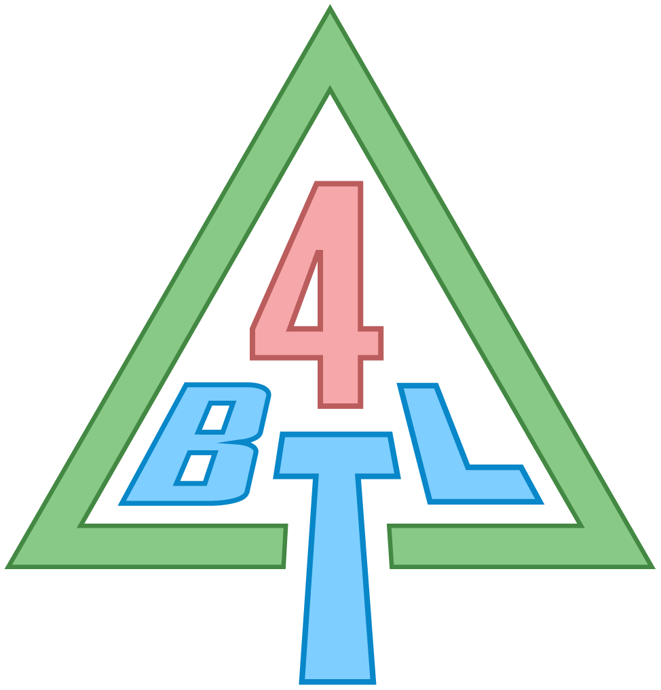

<p align="center">
  
</p>

<h1 align="center">Tarkas Brainlab IV — LearnBench</h1>

<p align="center">
  A web-based platform for practicing AI prompting and developing human-AI teaming skills through structured exercises, built on Google Apps Script and the Gemini API.
</p>

---

## Overview

LearnBench provides a streamlined platform for:
- Practicing text and image-based prompting with AI models (Gemini 1.5)
- Structured scenario-based exercises with configurable workflows
- Logging all interactions to Google Sheets
- Real-time display of AI responses
- CodeMirror-based prompt editor with syntax highlighting

## Architecture

- **Frontend**: HTML5 with CodeMirror editor
- **Backend**: Google Apps Script
- **Storage**: Google Sheets
- **AI Model**: Google Gemini API (configurable)
- **Hosting**: Google Apps Script Web App

## Setup Instructions

The supported path is **clasp** (Google's official Apps Script CLI). It uploads all ~35 files in `apps-script/` in one go. The old `scripts/quick-setup.js` clipboard helper only handles 3 files and will not produce a working app — don't use it.

### 1. Install dependencies

```bash
npm install
npm install -g @google/clasp
```

### 2. Authenticate clasp

```bash
clasp login
```

Opens a browser. Sign in with the Google account that should own the Apps Script project. Confirm with:

```bash
clasp show-authorized-user
```

### 3. Create the Apps Script project

```bash
npm run create
```

This runs `clasp create --type standalone --rootDir ./apps-script` and writes a `.clasp.json` linking your local repo to the new script. (Note: clasp v3 does not accept `--type webapp` — use `standalone`. The web-app deployment happens in step 6.)

### 4. Push all files

```bash
npm run push
```

Uploads every `.js`, `.html`, and `appsscript.json` under `apps-script/`. Re-run any time you change source.

### 5. Configure Script Properties and create the data sheet

Open the project in the editor:

```bash
npm run open
```

Then:

1. **Add `GEMINI_API_KEY`**: ⚙️ Project Settings → Script Properties → Add script property. Get a key at https://aistudio.google.com/apikey.
2. **Run `setupPromptLab`** from the editor:
   - In the editor, select `setup.js` in the file list.
   - In the function dropdown (next to ▶ Run), choose `setupPromptLab` → click **Run**.
   - First run triggers OAuth: you'll see *"Google hasn't verified this app"* — click **Advanced → Go to LearnBench (unsafe)** → Allow. The "unsafe" warning is normal for personal/unverified scripts.
   - The execution log will print the new spreadsheet URL. `setupPromptLab` also stores its ID in Script Properties as `PROMPTLAB_SHEET_ID` and configures the default class schedule.

### 6. Deploy as a web app

In the Apps Script editor: **Deploy → New deployment → ⚙️ → Web app**.

- **Execute as:** Me
- **Who has access:** Anyone (public) or Anyone with Google account (signed-in)

Click **Deploy** and copy the **Web app URL**. (The CLI alternative `npm run deploy` creates a deployment but the web-app config is easier to set in the UI.)

### 7. Development Workflow

**Watch for changes** (auto-push on save):
```bash
npm run watch  # Or: clasp push --watch
```

**View logs in real-time**:
```bash
npm run logs  # Or: clasp logs --tail
```

**Pull changes from Google**:
```bash
npm run pull  # Or: clasp pull
```

### 8. Access Permissions

On first deployment, you'll need to:
1. Review permissions
2. Grant access to:
   - Google Sheets (for data logging)
   - External network access (for Gemini API)

## Usage

### For Instructors

1. Share the deployment URL with learners
2. Monitor responses in the automatically created Google Sheet
3. Export data for analysis

### For Learners

1. Open the provided URL
2. Enter participant ID (last 4 characters of NRIC)
3. Complete optional demographics survey
4. Review scenario and respond to questions
5. Write prompts in the CodeMirror editor
6. Optionally attach images by:
   - Dragging and dropping onto the attachment area
   - Pasting from clipboard (Ctrl/Cmd+V)
   - Clicking to browse and select files
7. Submit prompts to receive AI responses
8. All interactions are automatically logged

## Features

- **Rich Text Editor**: CodeMirror with line numbers and syntax highlighting
- **Multimodal AI Support**: Submit text prompts with optional images
- **Image Upload Options**: 
  - Drag and drop images onto the upload area
  - Paste images from clipboard (Ctrl/Cmd+V)
  - Click to select images via file dialog
- **Real-time Processing**: Immediate AI responses from Gemini
- **Automatic Logging**: All prompts and responses saved to Google Sheets
- **Participant Tracking**: ID and cohort-based organization
- **Response Metadata**: Timestamps, token counts, processing time
- **Keyboard Shortcuts**: Ctrl+Enter to submit prompt

## Data Structure

The Google Sheet logs the following columns:
- Timestamp
- Participant ID
- Cohort ID
- Prompt
- AI Response
- Model Used
- Token Count
- Processing Time (ms)

## Configuration

### Setup Sheet
The system creates a "Setup" sheet in your Google Sheets with configurable parameters:
- **Enable AI**: Toggle AI responses on/off
- **Enable Context**: Maintain conversation context across prompts
- **Context Window**: Number of previous messages to include (default: 5)
- **Enable Demographics**: Show/hide demographics survey
- **Prompts Before Demographics**: When to show the survey (default: after 1 prompt)
- **Auto Advance Scenarios**: Automatically move to next scenario
- **Auto Close on Complete**: End session when all scenarios are done

### Image Support
The system supports multimodal prompts with Gemini 1.5:
- **Max file size**: 4MB per image
- **Supported formats**: JPEG, PNG, GIF, WebP
- **Multiple upload methods**: Drag & drop, paste, or file selection
- Images are base64 encoded and sent with the prompt to Gemini

## Customization

### Adding Scenarios
Edit the scenarios in the Setup sheet or modify `getAllScenariosForParticipant()` in Code.js

### Changing AI Models
The system automatically tries Gemini 1.5 Flash first, then falls back to Gemini Pro if needed. To modify:
```javascript
const models = [
  { name: 'gemini-1.5-flash', url: '...' },
  { name: 'gemini-pro', url: '...' }
];
```

### UI Themes
The interface supports light, dark, and system themes. Users can switch using the theme buttons in the header.

## Security Considerations

- API keys are stored in Script Properties (not in code)
- Web app executes under deployer's account
- Participant data is isolated in Google Sheets
- No client-side API calls

## Troubleshooting

### "Permission Denied" Error
- Ensure the web app is deployed with proper access settings
- Check that all required APIs are enabled

### No AI Response
- Verify Gemini API key is set correctly
- Check quota limits in Google Cloud Console
- Review execution logs in Apps Script editor

### Sheet Not Created
- Ensure the script has Drive and Sheets permissions
- Check for existing sheets with the same name

## Future Enhancements

- Multiple prompt types/templates
- Rubric-based scoring integration
- Export to various formats (CSV, JSON)
- A/B testing different models
- Time-constrained exercises
- Multi-turn conversations

## License

MIT License - See LICENSE file for details